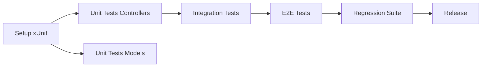
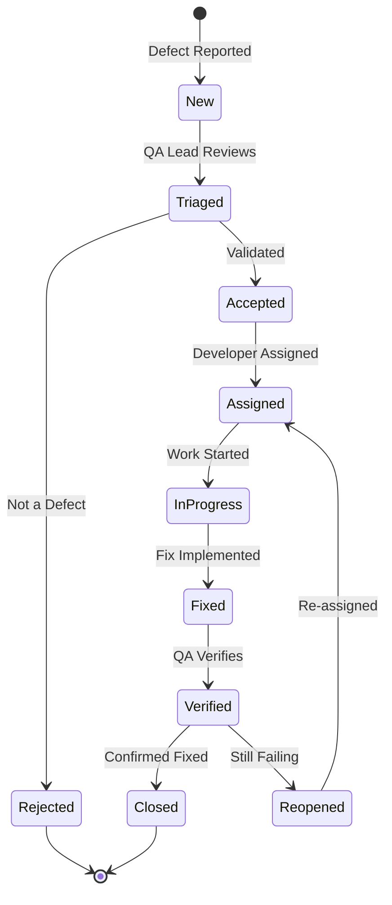

# Plan de Aseguramiento de Calidad: magero-store

## 1. Visión General del Plan de QA

### Propósito
Este documento define el plan de aseguramiento de calidad (QA) para el proyecto magero-store, estableciendo los estándares, procesos y métricas necesarias para garantizar la entrega de un producto de alta calidad que cumpla con los estándares ISTQB y ISO 25010.

### Alcance
El plan de QA cubre:
- Validación de requisitos funcionales y no funcionales
- Aseguramiento de calidad de código
- Pruebas a todos los niveles (unitarias, integración, E2E)
- Validación de seguridad y accesibilidad
- Gestión de defectos
- Métricas y reportes de calidad

### Objetivos de Calidad

| Objetivo | Métrica | Target | Método de Medición |
|----------|---------|--------|--------------------|
| Alta cobertura de pruebas | Code coverage | 80% líneas, 90% rutas críticas | coverlet |
| Bajo nivel de defectos | Defect density | < 5 defectos/KLOC | Tracking en GitHub Issues |
| Rápida detección de defectos | Detection efficiency | ≥ 95% pre-producción | Defect tracking |
| Alta automatización | Automation rate | ≥ 90% | Test suite metrics |
| Rendimiento óptimo | Response time | p95 < 500ms | Performance testing |
| Seguridad robusta | Security vulnerabilities | 0 críticos, 0 altos | Security scanning |
| Accesibilidad inclusiva | WCAG compliance | Nivel AA | axe-core + manual testing |

## 2. Puertas de Calidad (Quality Gates)

### Puerta de Calidad 1: Commit Level

**Criterios de Entrada:**
- [ ] Código compila sin errores
- [ ] Cambios seguidos por .gitignore apropiado
- [ ] Commit message sigue convenciones

**Validaciones Automáticas:**
```yaml
- Build exitoso (dotnet build)
- Pruebas unitarias pasando (100%)
- Análisis de código estático (SonarCloud)
- Security scanning básico (CodeQL)
```

**Criterios de Salida:**
- [ ] Build verde
- [ ] Zero build errors
- [ ] Todas las pruebas unitarias pasando
- [ ] No new security vulnerabilities

**Tiempo Máximo:** 5 minutos

### Puerta de Calidad 2: Pull Request Level

**Criterios de Entrada:**
- [ ] Puerta de Calidad 1 pasada
- [ ] PR template completado
- [ ] Descripción clara de cambios
- [ ] Issues relacionados vinculados

**Validaciones Automáticas:**
```yaml
- Suite completa de pruebas unitarias
- Pruebas de integración relevantes
- Code coverage ≥ 80%
- No regression en coverage
- Security scanning completo (CodeQL, dependency scan)
- Code quality metrics (SonarCloud)
```

**Validaciones Manuales:**
- [ ] Code review por al menos 1 reviewer
- [ ] Revisión de arquitectura (si aplica)
- [ ] Revisión de seguridad (para cambios críticos)
- [ ] Validación de tests escritos

**Criterios de Salida:**
- [ ] Todas las validaciones automáticas pasadas
- [ ] Code review aprobado
- [ ] No defectos críticos o altos introducidos
- [ ] Coverage mantiene o mejora threshold
- [ ] Merge conflicts resueltos
- [ ] CI/CD pipeline verde

**Tiempo Máximo de Review:** 24 horas laborables

### Puerta de Calidad 3: Integration Level

**Criterios de Entrada:**
- [ ] PR mergeado a rama principal
- [ ] Puerta de Calidad 2 completada
- [ ] Build de integración exitoso

**Validaciones Automáticas:**
```yaml
- Suite completa de pruebas de integración
- E2E smoke tests
- Performance benchmarks
- Security scanning profundo
- Dependency vulnerability scan
- Database migration tests (si aplica)
```

**Criterios de Salida:**
- [ ] Todas las pruebas de integración pasando
- [ ] E2E smoke tests verdes
- [ ] Performance dentro de SLAs
- [ ] No vulnerabilidades críticas/altas
- [ ] Migrations ejecutan correctamente

**Tiempo Máximo:** 15 minutos

### Puerta de Calidad 4: Pre-Release Level

**Criterios de Entrada:**
- [ ] Todas las features del sprint completadas
- [ ] Puerta de Calidad 3 completada para todas las features
- [ ] Release notes preparadas

**Validaciones Automáticas:**
```yaml
- Suite completa de regresión
- E2E test suite completa
- Performance testing completo
- Load testing
- Security testing exhaustivo (OWASP ZAP)
- Accessibility testing (axe-core)
```

**Validaciones Manuales:**
- [ ] UAT (User Acceptance Testing)
- [ ] Exploratory testing
- [ ] Security review manual
- [ ] Accessibility manual testing
- [ ] Cross-browser testing
- [ ] Mobile testing

**Criterios de Salida:**
- [ ] 95% de pruebas pasando (5% pueden ser conocidas, documentadas, no críticas)
- [ ] Zero defectos críticos abiertos
- [ ] Zero defectos altos sin plan de mitigación
- [ ] Performance SLAs cumplidos
- [ ] Security scan sin críticos/altos
- [ ] WCAG Level AA compliance
- [ ] UAT sign-off obtenido
- [ ] Release notes completas

**Tiempo de Validación:** 2-3 días

### Puerta de Calidad 5: Production Deployment

**Criterios de Entrada:**
- [ ] Puerta de Calidad 4 completada
- [ ] Deployment plan aprobado
- [ ] Rollback plan documentado
- [ ] Monitoring configurado

**Validaciones Pre-Deployment:**
```yaml
- Smoke tests en staging
- Database backup verificado
- Health checks funcionando
- Monitoring alerts configuradas
- Deployment automation testeada
```

**Validaciones Post-Deployment:**
```yaml
- Health checks pasando
- Smoke tests en producción
- Performance monitoring (primeros 15 min)
- Error rate monitoring
- User session monitoring
```

**Criterios de Salida:**
- [ ] Aplicación respondiendo correctamente
- [ ] Health checks verdes
- [ ] Error rate < 1%
- [ ] Performance dentro de SLAs
- [ ] No critical errors en logs
- [ ] Monitoring dashboards verdes

**Rollback Criteria:**
- Error rate > 5%
- Critical functionality no disponible
- Performance degradation > 50%
- Security breach detectado

## 3. Estándares de Calidad para GitHub Issues

### Template Compliance

**Todos los test issues deben usar templates apropiados:**
- ✅ Test Strategy issues: `test-strategy.md` template
- ✅ Unit Test issues: `unit-test.md` template
- ✅ Integration Test issues: `integration-test.md` template
- ✅ Playwright E2E issues: `playwright-test.md` template
- ✅ Security Test issues: `security-test.md` template
- ✅ Accessibility Test issues: `accessibility-test.md` template
- ✅ Quality Assurance issues: `quality-assurance.md` template

### Campos Requeridos

**Todos los issues de testing deben incluir:**

| Campo | Descripción | Obligatorio |
|-------|-------------|-------------|
| **Title** | Formato: "[Tipo]: [Componente/Feature]" | ✅ |
| **Description** | Contexto y alcance de las pruebas | ✅ |
| **Test Cases** | Lista de casos de prueba específicos | ✅ |
| **ISTQB Technique** | Técnica de diseño ISTQB aplicada | ✅ |
| **Acceptance Criteria** | Criterios claros de completitud | ✅ |
| **Estimate** | Story points estimados | ✅ |
| **Labels** | Etiquetas apropiadas (ver sección siguiente) | ✅ |
| **Priority** | Nivel de prioridad del testing | ✅ |
| **Dependencies** | Issues bloqueantes o relacionados | Si aplica |
| **ISO 25010 Characteristic** | Característica de calidad validada | Para non-functional |

### Calidad de Descripción

**Criterios de calidad para descripciones de issues:**

✅ **Buena descripción:**
```markdown
# Unit Tests: CartController.AddToCart

## Test Implementation Scope
Validación completa del método AddToCart incluyendo:
- Agregar producto nuevo al carrito
- Incrementar cantidad de producto existente
- Manejar producto inexistente

## ISTQB Test Case Design
**Test Design Technique**: Decision Table Testing
**Test Type**: Functional Testing

## Test Cases to Implement
1. **Agregar producto nuevo**: Verifica que un producto se agrega correctamente con cantidad = 1
2. **Producto existente**: Verifica que la cantidad se incrementa sin crear duplicado
3. **Producto inexistente**: Verifica que retorna NotFound sin modificar carrito

## Acceptance Criteria
- [ ] 3 test cases implementados
- [ ] Code coverage de AddToCart ≥ 90%
- [ ] Tests pasando en CI/CD
```

❌ **Mala descripción:**
```markdown
# Test cart
Add tests for cart
```

### Validación de Templates

**Proceso de validación:**
1. **Automated Check**: GitHub Actions valida que issue usa template
2. **Manual Review**: QA Lead revisa issues semanalmente
3. **Feedback Loop**: Issues incompletos se comentan con feedback específico
4. **Quality Metric**: % de issues compliant tracked mensualmente

**Target:** ≥ 95% de issues usando templates correctamente

## 4. Etiquetado y Priorización

### Sistema de Labels

#### Labels de Tipo de Prueba

| Label | Descripción | Color |
|-------|-------------|-------|
| `unit-test` | Pruebas unitarias |  `#0E8A16` |
| `integration-test` | Pruebas de integración |  `#006B75` |
| `e2e-test` | Pruebas end-to-end |  `#1D76DB` |
| `performance-test` | Pruebas de rendimiento |  `#FBCA04` |
| `security-test` | Pruebas de seguridad |  `#D93F0B` |
| `accessibility-test` | Pruebas de accesibilidad |  `#5319E7` |
| `load-test` | Pruebas de carga |  `#FEF2C0` |
| `regression-test` | Pruebas de regresión |  `#C2E0C6` |

#### Labels de Componente

| Label | Descripción |
|-------|-------------|
| `frontend-test` | Pruebas de frontend/UI |
| `backend-test` | Pruebas de backend/API |
| `database-test` | Pruebas de base de datos |
| `api-test` | Pruebas de API endpoints |
| `controller-test` | Pruebas de controllers |
| `model-test` | Pruebas de models |

#### Labels de Prioridad de Testing

| Label | Criterio | SLA de Implementación |
|-------|----------|----------------------|
| `test-critical` | Funcionalidad core, seguridad crítica | Sprint actual |
| `test-high` | Funcionalidad importante, riesgos altos | Próximo sprint |
| `test-medium` | Funcionalidad estándar | 2 sprints |
| `test-low` | Nice-to-have, cosmético | Backlog |

#### Labels de Calidad y Estándares

| Label | Descripción |
|-------|-------------|
| `quality-gate` | Issue relacionado con quality gates |
| `iso25010` | Validación de característica ISO 25010 |
| `istqb-technique` | Usa técnica específica de ISTQB |
| `risk-based` | Testing basado en análisis de riesgos |
| `wcag` | Relacionado con WCAG compliance |
| `owasp` | Relacionado con OWASP Top 10 |

#### Labels de Tecnología

| Label | Descripción |
|-------|-------------|
| `playwright` | Usa Playwright para testing |
| `xunit` | Usa xUnit framework |
| `moq` | Usa Moq para mocking |
| `coverlet` | Relacionado con code coverage |

#### Labels de Estado

| Label | Descripción |
|-------|-------------|
| `blocked` | Bloqueado por dependencias |
| `needs-review` | Requiere revisión de QA Lead |
| `automation-ready` | Listo para automatización |
| `manual-test-required` | Requiere testing manual |

### Estrategia de Priorización

#### Criterios de Priorización

**Matriz de Priorización basada en Riesgo:**

| Impacto / Probabilidad | Alta | Media | Baja |
|------------------------|------|-------|------|
| **Alto** | Critical | High | High |
| **Medio** | High | Medium | Medium |
| **Bajo** | Medium | Medium | Low |

**Factores de Impacto:**
- Afecta funcionalidad core del negocio
- Impacta seguridad o privacidad
- Afecta múltiples usuarios
- Daño reputacional potencial
- Costo de fallo en producción

**Factores de Probabilidad:**
- Complejidad del código
- Frecuencia de uso
- Historial de defectos
- Cambios recientes
- Cobertura de pruebas actual

#### Ejemplos de Priorización

**Critical Priority:**
- SQL Injection prevention testing
- Cart checkout functionality
- Payment processing (cuando se implemente)
- User authentication (cuando se implemente)

**High Priority:**
- Product search functionality
- Cart management (add/remove/update)
- Session management
- Cross-browser compatibility

**Medium Priority:**
- Product listing pagination
- Sorting and filtering
- UI responsiveness
- Error message clarity

**Low Priority:**
- Cosmetic UI issues
- Performance optimizations (después de baseline)
- Advanced accessibility features (más allá de AA)

### Proceso de Etiquetado

**Responsabilidades:**

| Rol | Responsabilidad |
|-----|----------------|
| **Issue Creator** | Aplica labels básicos (tipo, componente) |
| **QA Lead** | Valida y ajusta labels de prioridad y calidad |
| **Tech Lead** | Revisa labels técnicos y estimaciones |
| **Scrum Master** | Asegura consistencia y facilita resolución de conflictos |

**Workflow:**
1. Creator crea issue con template y aplica labels iniciales
2. Automated checks validan template compliance
3. QA Lead revisa y ajusta prioridad (dentro de 24h)
4. Tech Lead revisa estimación técnica
5. Issue ready for sprint planning

## 5. Validación y Gestión de Dependencias

### Detección de Dependencias Circulares

**Proceso automatizado:**

```yaml
# GitHub Actions workflow snippet
- name: Check for circular dependencies
  run: |
    # Script que analiza issues y detecta dependencias circulares
    python scripts/check_circular_dependencies.py
```

**Criterios de detección:**
- Issue A depende de Issue B
- Issue B depende de Issue A (directa o indirectamente)
- Cadena de dependencias que forma ciclo

**Acción correctiva:**
- Issue automáticamente marcado con label `circular-dependency`
- Notificación al QA Lead y Tech Lead
- Bloqueado de sprint planning hasta resolución

### Análisis de Ruta Crítica

**Identificación de ruta crítica de testing:**



**Issues en ruta crítica:**
- Marcados con label `critical-path`
- Prioridad automáticamente elevada
- Tracking diario de progreso
- Blockers escalados inmediatamente

**Métricas de ruta crítica:**
- Días de slack disponibles
- Probabilidad de completitud a tiempo
- Impacto de delays en release date

### Evaluación de Impacto de Dependencias

**Matriz de impacto:**

| Dependencia | Issues Bloqueados | Impacto en Timeline | Risk Score |
|-------------|-------------------|---------------------|------------|
| Setup xUnit | 15 unit test issues | 5 días | Critical |
| Setup Playwright | 8 E2E issues | 3 días | High |
| Database setup | 3 integration issues | 1 día | Medium |

**Cálculo de Risk Score:**
```
Risk Score = (Número de issues bloqueados × Impacto promedio) / Tiempo estimado de resolución
```

**Clasificación:**
- Critical: Risk Score > 10
- High: Risk Score 5-10
- Medium: Risk Score 2-5
- Low: Risk Score < 2

### Estrategias de Mitigación

**Para dependencias críticas:**

1. **Paralelización:**
   - Identificar trabajo que puede hacerse en paralelo
   - Crear spikes para resolver dependencias rápido
   - Pair programming para acelerar blockers

2. **Mocking y Stubbing:**
   - Crear mocks de componentes no disponibles
   - Stubs temporales para desbloquear trabajo
   - Reemplazar con implementación real cuando disponible

3. **Inversión de Dependencias:**
   - Interfaces para desacoplar componentes
   - Dependency injection para flexibility
   - Contract testing para validar integraciones

4. **Spike Solutions:**
   - Time-boxed investigation (4-8 horas)
   - Prototipos rápidos para validar approach
   - Decision documentation

**Proceso de gestión:**

```yaml
Dependencia Bloqueada:
  1. Notificación automática a stakeholders
  2. Evaluación de impacto (2 horas)
  3. Identificación de alternativas
  4. Decisión: Wait / Mitigate / Re-prioritize
  5. Tracking diario hasta resolución
```

## 6. Precisión y Revisión de Estimaciones

### Análisis de Datos Históricos

**Fuentes de datos:**
- Velocity histórico del equipo
- Tiempo real vs estimado en sprints anteriores
- Complejidad de issues similares
- Tasa de cambio de scope

**Métricas tracked:**

| Métrica | Cálculo | Target |
|---------|---------|--------|
| **Estimation Accuracy** | Σ(Actual/Estimated) / N | 0.8 - 1.2 |
| **Velocity Stability** | StdDev(Velocity) | < 20% de promedio |
| **Scope Creep Rate** | Stories added / Sprint | < 10% |
| **Estimation Confidence** | % dentro de ±20% | > 75% |

**Refinamiento de estimaciones:**

```
Estimación Ajustada = Estimación Base × Factor de Complejidad × Factor Histórico

Factor de Complejidad:
- Simple: 0.8
- Moderado: 1.0
- Complejo: 1.3
- Muy Complejo: 1.8

Factor Histórico = Promedio(Actual/Estimado) últimos 3 sprints
```

### Revisión por Tech Lead

**Proceso de revisión:**

1. **Pre-Planning Review (1-2 días antes de planning):**
   - Tech Lead revisa todos los issues del backlog candidato
   - Valida estimaciones técnicas
   - Identifica issues sub-estimados o sobre-estimados
   - Agrega comentarios con justificación

2. **Criterios de revisión:**

   | Aspecto | Checklist |
   |---------|-----------|
   | **Complejidad Técnica** | ¿La complejidad técnica está correctamente reflejada? |
   | **Dependencias Técnicas** | ¿Todas las dependencias técnicas identificadas? |
   | **Assumptions** | ¿Assumptions documentadas y válidas? |
   | **Edge Cases** | ¿Edge cases considerados en estimación? |
   | **Technical Debt** | ¿Impacto de technical debt considerado? |

3. **Resultado de revisión:**
   - ✅ Approved: Estimación validada
   - 🔄 Needs Adjustment: Estimación revisada con justificación
   - ❌ Needs Breakdown: Issue muy grande, requiere desglose

### Asignación de Buffer de Riesgo

**Estrategia de buffering:**

**Buffer por tipo de work:**

| Tipo de Prueba | Complexity Factor | Uncertainty Factor | Buffer Recomendado |
|----------------|-------------------|--------------------|--------------------|
| Unit Tests | Bajo | Bajo | +10% |
| Integration Tests | Medio | Medio | +25% |
| E2E Tests | Alto | Medio | +35% |
| Performance Tests | Alto | Alto | +50% |
| Security Tests | Medio | Alto | +40% |
| Exploratory Tests | Alto | Muy Alto | +60% |

**Cálculo de buffer:**
```
Story Points con Buffer = Story Points Base × (1 + Buffer %)

Ejemplo: 
- Unit Test base: 0.5 SP
- Buffer: 10%
- Estimación final: 0.5 × 1.1 = 0.55 ≈ 1 SP (redondeado)
```

**Buffer a nivel de sprint:**
- Sprint capacity nominal: 15 SP
- Buffer recomendado: 20% (3 SP)
- Commitment: 12 SP
- Stretch goals: 3 SP adicionales

### Refinamiento Iterativo

**Proceso de refinamiento:**

**Sprint N-1 (2 semanas antes):**
- High-level estimation de epic de testing
- Identificación de issues principales
- Rough order of magnitude (T-shirt sizing)

**Sprint N-0.5 (1 semana antes):**
- Breakdown de epics en issues
- Story point estimation inicial
- Identificación de dependencias

**Sprint N Planning:**
- Refinamiento final de estimaciones
- Ajuste basado en velocity actual
- Commitment del equipo

**During Sprint:**
- Re-estimation si scope cambia significativamente
- Tracking de actual vs estimado
- Ajuste de estimaciones futuras basado en aprendizaje

**Sprint Retrospective:**
- Revisión de estimation accuracy
- Identificación de causas de desviación
- Ajuste de factores de complejidad
- Documentación de learnings

### Métricas de Precisión de Estimación

**KPIs tracked:**

```yaml
Estimation Accuracy Metrics:
  - Average Estimation Error: Target < 20%
  - Estimation Bias: Target between -10% and +10%
  - Estimation Variance: Target StdDev < 25%
  - Re-estimation Rate: Target < 15% of issues
  
Calculation:
  Estimation Error = (Actual - Estimated) / Estimated × 100%
  Estimation Bias = Average(Estimation Error)
  Estimation Variance = StdDev(Estimation Error)
```

**Visualización:**
- Sprint-over-sprint accuracy trends
- Distribution of estimation errors
- Accuracy by issue type
- Accuracy by team member

**Acción correctiva cuando accuracy < target:**
1. Retrospective específica de estimation
2. Calibration session con el equipo
3. Planning poker para re-alinear understanding
4. Reference user stories para cada story point value

## 7. Métricas y KPIs de Calidad

### Dashboard de Calidad

**Métricas en tiempo real:**

#### Coverage Metrics
```yaml
Code Coverage:
  - Line Coverage: Current / Target (80%)
  - Branch Coverage: Current / Target (90% critical paths)
  - Method Coverage: Current / Target (85%)
  
Test Coverage:
  - Unit Test Coverage: # unit tests / # units
  - Integration Test Coverage: # integration tests / # integrations
  - E2E Test Coverage: # E2E scenarios / # user journeys
```

#### Quality Metrics
```yaml
Code Quality:
  - Technical Debt: Hours / Target (< 8 hours)
  - Code Smells: Count / Severity
  - Duplications: % / Target (< 3%)
  - Maintainability Index: Score / Target (> 20)

Defect Metrics:
  - Open Defects by Severity: Critical/High/Medium/Low
  - Defect Density: Defects per KLOC
  - Defect Escape Rate: % defects found in production
  - Defect Resolution Time: Average by severity
```

#### Test Execution Metrics
```yaml
Test Execution:
  - Tests Passed: Count / %
  - Tests Failed: Count / %
  - Tests Skipped: Count / %
  - Test Execution Time: Total time / Trend
  
CI/CD Metrics:
  - Build Success Rate: % / Target (> 95%)
  - Pipeline Duration: Time / Target (< 15 min)
  - Deployment Frequency: Count per week
  - Mean Time to Recovery (MTTR): Hours
```

### Reportes de Calidad

**Reporte Diario (Automated):**
```markdown
# Daily Quality Report - {{date}}

## Test Execution Summary
- ✅ Passed: 245 (95%)
- ❌ Failed: 8 (3%)
- ⏭️ Skipped: 5 (2%)

## New Issues
- 🔴 Critical: 0
- 🟠 High: 1
- 🟡 Medium: 3
- 🟢 Low: 2

## Quality Gates Status
- Commit Level: ✅ Passing
- PR Level: ✅ Passing
- Integration Level: ⚠️ Warning (1 flaky test)

## Coverage
- Line Coverage: 78% (↓ 2% from yesterday)
- Action Required: Review uncovered lines in new code

## Blockers
- None
```

**Reporte Semanal (Sprint Review):**
```markdown
# Weekly Quality Report - Sprint {{sprint_number}}

## Sprint Progress
- Story Points Completed: 12 / 15 (80%)
- Testing Stories Completed: 8 / 10
- Quality Gates Passed: 45 / 47 (96%)

## Test Coverage Evolution
- Week 1: 65%
- Week 2: 78% ← Current
- Sprint Goal: 80%
- Trajectory: On track 📈

## Defect Summary
- New Defects: 15
- Resolved Defects: 18
- Net Change: -3 ✅
- Open Critical/High: 0 ✅

## Quality Characteristics (ISO 25010)
- ✅ Functional Suitability: 95% coverage
- ✅ Security: No critical vulnerabilities
- ⚠️ Performance: 1 test below threshold
- ✅ Accessibility: WCAG AA on 80% of pages

## Risks and Issues
1. Performance test failing on Product Search
   - Impact: Medium
   - Mitigation: Investigation spike planned
2. E2E tests occasionally flaky
   - Impact: Low
   - Mitigation: Adding retry logic

## Next Week Focus
- Complete remaining 2 testing stories
- Achieve 80% coverage goal
- Fix performance issue
- Stabilize E2E tests
```

**Reporte de Release:**
```markdown
# Release Quality Report - v{{version}}

## Executive Summary
✅ **READY FOR RELEASE**

All quality gates passed. Zero critical/high defects. 
Performance and security requirements met.

## Test Summary
- Total Tests: 387
- Pass Rate: 98.7%
- Execution Time: 12 minutes
- Flaky Tests: 0

## Quality Characteristics Assessment (ISO 25010)

### Functional Suitability ✅
- Completeness: 100% requirements covered
- Correctness: 98.7% tests passing
- Appropriateness: UAT approved

### Performance Efficiency ✅
- Response Time: p95 = 420ms (target: <500ms)
- Resource Utilization: Within limits
- Capacity: 100 concurrent users validated

### Security ✅
- OWASP Top 10: All mitigated
- Dependency Vulnerabilities: 0 critical, 0 high
- Security Tests: 100% passing

### Usability ✅
- WCAG 2.1 Level AA: Compliant
- Accessibility Tests: 100% passing
- UAT Feedback: Positive

### Reliability ✅
- Test Stability: 100% (no flaky tests)
- Error Handling: Validated
- Recovery: Tested and documented

## Known Issues
- Minor UI alignment issue on Safari (logged as LOW priority)
- Performance on extremely large catalogs (>10K products) not tested

## Sign-Off
- [ ] QA Lead: _________________ Date: _______
- [ ] Tech Lead: _______________ Date: _______
- [ ] Product Owner: ___________ Date: _______
- [ ] Security Lead: ____________ Date: _______
```

### Tracking de Mejora Continua

**Quarterly Quality Review:**

```markdown
# Q{{quarter}} Quality Retrospective

## Objectives vs Actuals

| Metric | Target | Q{{quarter}} | Status |
|--------|--------|--------------|--------|
| Code Coverage | 80% | 82% | ✅ Exceeded |
| Defect Density | <5/KLOC | 3.2/KLOC | ✅ Met |
| Detection Efficiency | >95% | 96.5% | ✅ Met |
| Automation Rate | >90% | 88% | ⚠️ Close |
| MTTR | <4h | 3.2h | ✅ Met |

## Improvements Implemented
1. Introduced Playwright for E2E testing
   - Impact: Reduced E2E test time by 40%
2. Implemented quality gates in CI/CD
   - Impact: 30% reduction in defects reaching staging
3. Started security scanning in PR
   - Impact: 5 vulnerabilities caught early

## Challenges Faced
1. Initial flakiness in E2E tests
   - Resolution: Improved wait strategies, added retries
2. Coverage goal challenging for legacy code
   - Resolution: Focused on new code, incremental improvement

## Action Items for Next Quarter
- [ ] Increase automation rate to 92%
- [ ] Reduce average E2E execution time to <10 min
- [ ] Implement performance regression testing
- [ ] Train team on advanced Playwright features
```

## 8. Proceso de Gestión de Defectos

### Workflow de Defectos



### SLA por Severidad

| Severidad | Primera Respuesta | Resolución Target | Escalación |
|-----------|-------------------|-------------------|------------|
| **Critical** | 1 hora | 24 horas | Inmediata a CTO |
| **High** | 4 horas | 3 días | 2 días sin progreso |
| **Medium** | 1 día | 1 semana | 1 semana sin progreso |
| **Low** | 3 días | 2 semanas | No aplica |

### Template de Reporte de Defecto

```markdown
# 🐛 [Severity] Brief Description

## Environment
- **Browser/Device**: Chrome 120 / Windows 11
- **Environment**: QA / Staging / Production
- **Version**: v1.2.3
- **User Role**: Admin / Customer / Guest

## Steps to Reproduce
1. Navigate to Product Search page
2. Enter search term "laptop"
3. Click Search button
4. Observe results

## Expected Behavior
Search should return products matching "laptop"

## Actual Behavior
Search returns empty results despite matching products existing

## Impact
- Users affected: All users using search feature
- Business impact: Lost sales, poor UX
- Workaround available: Direct product browsing works

## Evidence
- Screenshots: [attached]
- Logs: [attached]
- Video: [link]
- Network trace: [attached]

## Additional Context
- Started happening after deployment on 2024-01-15
- Related to PR #123
- Might be related to issue #456

## Suggested Fix
Check SQL query in ProductsController.Search method

---
**Labels**: `bug`, `critical`, `search`, `backend`
**Assigned to**: @developer
**Related Issues**: #456
```

## 9. Comunicación y Colaboración

### Canales de Comunicación

| Canal | Propósito | Frecuencia | Participantes |
|-------|-----------|------------|---------------|
| **Daily Standup** | Status updates, blockers | Diario, 15 min | Todo el equipo |
| **Quality Sync** | Quality metrics review | 2× por semana | QA Team, Tech Lead |
| **Sprint Planning** | Planning de testing stories | Por sprint | Todo el equipo |
| **Sprint Review** | Demo de testing, metrics | Fin de sprint | Stakeholders |
| **Sprint Retro** | Mejora de procesos | Fin de sprint | Todo el equipo |
| **Bug Triage** | Priorización de defectos | Según necesidad | QA Lead, Tech Lead, PO |
| **Slack #quality** | Async communication | Continuo | Interesados |

### Matriz RACI

| Actividad | QA Lead | QA Engineer | Developer | Tech Lead | PO | DevOps |
|-----------|---------|-------------|-----------|-----------|----|----|
| Test Strategy | **R** | C | C | **A** | I | I |
| Test Implementation | C | **R** | C | **A** | I | I |
| Test Execution | I | **R** | C | **A** | I | I |
| Defect Triage | **R** | C | I | C | **A** | I |
| Quality Gates | **R** | C | C | **A** | I | C |
| CI/CD Pipeline | C | I | C | C | I | **R/A** |
| Security Testing | **R** | C | I | C | I | C |
| Performance Testing | C | **R** | C | **A** | I | C |
| UAT | C | C | I | I | **R/A** | I |
| Release Sign-off | C | I | I | C | **A** | C |

**Leyenda:**
- **R**: Responsible (hace el trabajo)
- **A**: Accountable (toma la decisión final)
- **C**: Consulted (consultado para input)
- **I**: Informed (informado de decisiones)

## 10. Plan de Capacitación

### Entrenamiento del Equipo

#### Onboarding de QA Engineers (Nueva contratación)

**Semana 1: Fundamentos**
- Overview del producto magero-store
- Setup de entorno de desarrollo y testing
- Introducción a herramientas (xUnit, Playwright, k6)
- Revisión de documentación de calidad

**Semana 2: Testing Practices**
- Técnicas ISTQB aplicadas
- Estándares ISO 25010
- Code review de tests existentes
- Pair testing con QA senior

**Semana 3-4: Hands-on**
- Implementar primeros unit tests
- Crear primer E2E test con Playwright
- Participar en bug triage
- Completar primera testing story

#### Entrenamiento Continuo

**Mensual:**
- Brown bag sessions (1 hora)
- Temas: New testing techniques, tools, learnings

**Quarterly:**
- Workshop formal (medio día)
- Certificación ISTQB (opcional pero incentivada)
- Conference attendance (1 por persona por año)

**Anual:**
- Testing conference
- Certification renewal
- Skills assessment

### Knowledge Sharing

**Documentación:**
- Wiki interno con best practices
- Video tutorials de herramientas
- Code examples repository
- Troubleshooting guides

**Collaboration:**
- Pair testing sessions
- Code review de tests
- Mob testing para features complejas
- Cross-training entre QA y Dev

## 11. Criterios de Éxito del Plan de QA

### Métricas de Éxito

**Technical Metrics:**
- ✅ Code coverage: ≥ 80%
- ✅ Test automation: ≥ 90%
- ✅ Defect detection: ≥ 95% pre-production
- ✅ Build success rate: ≥ 95%
- ✅ Zero critical vulnerabilities

**Process Metrics:**
- ✅ Quality gate pass rate: ≥ 95%
- ✅ Estimation accuracy: ±20%
- ✅ Issue template compliance: ≥ 95%
- ✅ SLA compliance: ≥ 90%

**Business Metrics:**
- ✅ Production defects: < 2 per release
- ✅ MTTR: < 4 hours
- ✅ User satisfaction: > 4.5/5
- ✅ Release frequency: 2 por mes

### Review y Actualización

**Plan de QA se revisa:**
- Por sprint: Métricas y ajustes tácticos
- Por quarter: Objetivos estratégicos
- Por release: Effectiveness del plan
- Anual: Revisión completa y actualización mayor

**Triggers para revisión extraordinaria:**
- Cambio significativo en arquitectura
- Nuevo tech stack o herramientas
- Cambios en equipo (>30% turnover)
- Defectos críticos en producción
- Cambio en objetivos de negocio

---

**Aprobaciones:**

- [ ] QA Lead: _____________________________ Fecha: _________
- [ ] Tech Lead: ____________________________ Fecha: _________
- [ ] Product Owner: ________________________ Fecha: _________
- [ ] Engineering Manager: __________________ Fecha: _________

**Versión:** 1.0
**Fecha:** 2024
**Próxima Revisión:** Fin de Q1 2024
**Owner:** QA Lead
**Stakeholders:** Engineering Team, Product Team, Management
