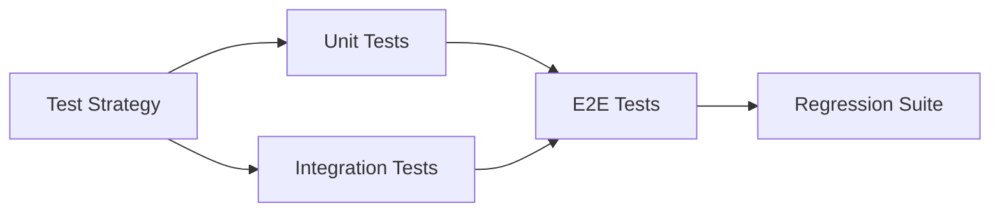
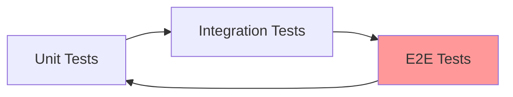
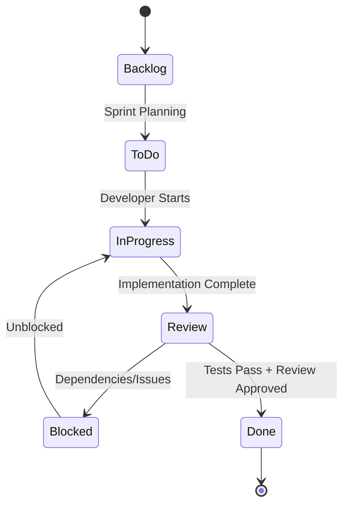
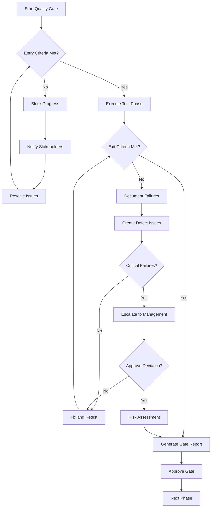

# Quality Assurance Plan: Magero Store E-Commerce Platform

## Executive Summary

Este plan de aseguramiento de calidad (QA) establece los estándares, procesos y procedimientos para garantizar que la plataforma Magero Store cumpla con los más altos estándares de calidad alineados con ISO 25010 e ISTQB frameworks.

### Objetivos del QA Plan
1. Establecer quality gates y checkpoints claros
2. Definir estándares para GitHub issues y documentación
3. Implementar sistema de etiquetado y priorización consistente
4. Gestionar dependencias y riesgos efectivamente
5. Asegurar estimaciones precisas y revisión técnica

## Quality Gates and Checkpoints

### Entry Criteria (Criterios de Entrada)

#### Para Unit Testing
- [ ] Código implementado y commiteado
- [ ] Código compila sin errores
- [ ] Code review inicial completado
- [ ] Documentación XML generada
- [ ] Test framework configurado (xUnit)

#### Para Integration Testing
- [ ] Unit tests pasando con 80%+ coverage
- [ ] Todas las interfaces definidas
- [ ] Configuración de test database completa
- [ ] Datos de prueba preparados
- [ ] Dependencias resueltas

#### Para E2E Testing (Playwright)
- [ ] Integration tests pasando
- [ ] Aplicación desplegada en ambiente de prueba
- [ ] Playwright configurado y navegadores instalados
- [ ] Test data seeding funcional
- [ ] Casos de prueba documentados

#### Para Performance Testing
- [ ] Todos los functional tests pasando
- [ ] Aplicación en ambiente de staging
- [ ] Herramientas de performance instaladas (k6/JMeter)
- [ ] Baseline metrics establecido
- [ ] Escenarios de carga definidos

#### Para Security Testing
- [ ] Código completamente implementado
- [ ] Functional testing completo
- [ ] Security tools configurados (OWASP ZAP, Snyk)
- [ ] Threat model documentado
- [ ] Security checklist preparado

### Exit Criteria (Criterios de Salida)

#### Para Unit Testing Phase
- [ ] 85%+ code coverage en controllers
- [ ] 90%+ code coverage en models
- [ ] 80%+ code coverage en data access
- [ ] 0 failing tests
- [ ] 0 critical code smells (SonarCloud)
- [ ] Complejidad ciclomática < 15
- [ ] Code review aprobado

#### Para Integration Testing Phase
- [ ] 95%+ integration tests passing
- [ ] Todos los flujos de integración validados
- [ ] Database transactions funcionan correctamente
- [ ] Session management validado
- [ ] API responses consistentes
- [ ] Error handling completo

#### Para E2E Testing Phase
- [ ] 95%+ E2E tests passing (permitir 5% flakiness)
- [ ] Todos los user journeys críticos validados
- [ ] Cross-browser tests pasando (Chrome, Firefox, Safari, Edge)
- [ ] Responsive tests pasando (mobile, tablet, desktop)
- [ ] Screenshots/videos de fallos capturados
- [ ] Accessibility tests pasando (WCAG 2.1 AA)

#### Para Performance Testing Phase
- [ ] Page load times < 2 segundos (90th percentile)
- [ ] API response times < 500ms (95th percentile)
- [ ] 100 concurrent users soportados
- [ ] Memory usage < 512MB under load
- [ ] CPU usage < 50% under normal load
- [ ] 0 memory leaks detectados

#### Para Security Testing Phase
- [ ] 0 vulnerabilidades críticas
- [ ] < 5 vulnerabilidades altas (con plan de mitigación)
- [ ] OWASP Top 10 validado
- [ ] Dependencias sin vulnerabilidades conocidas
- [ ] Input validation completa
- [ ] Session security validada
- [ ] Security scan report generado

### Quality Metrics (Métricas de Calidad)

#### Code Quality Metrics
```yaml
Targets:
  - Code Coverage: ≥ 80%
  - Branch Coverage: ≥ 90% (rutas críticas)
  - Cyclomatic Complexity: < 15
  - Technical Debt: < 5%
  - Code Smells: 0 critical, < 10 major
  - Duplicated Code: < 3%
  - Maintainability Index: ≥ 70

Measurement:
  - Tool: SonarCloud / Coverlet
  - Frequency: Each PR
  - Reporting: Dashboard + PR comments
```

#### Test Quality Metrics
```yaml
Targets:
  - Test Pass Rate: ≥ 95%
  - Test Flakiness: < 5%
  - Test Coverage: ≥ 80% code, 100% AC
  - Automated Tests: ≥ 90%
  - Test Execution Time: < 15 min (full suite)
  - Mean Time to Detect (MTTD): < 24 hours

Measurement:
  - Tool: GitHub Actions / Test Reports
  - Frequency: Each test run
  - Reporting: CI/CD dashboard
```

#### Defect Metrics
```yaml
Targets:
  - Defect Detection Rate: ≥ 95% pre-production
  - Critical Defects in Production: 0
  - Defect Density: < 1 defect per KLOC
  - Mean Time to Resolve (MTTR):
    - Critical: < 4 hours
    - High: < 24 hours
    - Medium: < 72 hours
    - Low: < 1 week

Measurement:
  - Tool: GitHub Issues
  - Frequency: Daily
  - Reporting: Weekly QA report
```

#### Performance Metrics
```yaml
Targets:
  - Response Time (p90): < 2 seconds
  - Response Time (p95): < 3 seconds
  - Response Time (p99): < 5 seconds
  - Throughput: ≥ 50 TPS
  - Error Rate: < 0.1%
  - Availability: ≥ 99.9%

Measurement:
  - Tool: k6 / Lighthouse / Application Insights
  - Frequency: Weekly / Per release
  - Reporting: Performance dashboard
```

### Escalation Procedures

#### Quality Gate Failure Escalation

**Level 1: Team Level (0-4 hours)**
- QA Engineer identifies gate failure
- Creates GitHub issue with label `quality-gate-failure`
- Notifies Tech Lead and development team
- Team attempts resolution

**Level 2: Lead Level (4-24 hours)**
- If unresolved after 4 hours, escalate to QA Lead
- QA Lead assesses impact and urgency
- Coordinates with Engineering Manager
- May adjust exit criteria or approve deviation with risk assessment

**Level 3: Management Level (24+ hours)**
- If unresolved after 24 hours, escalate to Engineering Manager
- Risk assessment and mitigation plan required
- Product Owner notified of potential impact
- Decision on release delay or controlled deployment with monitoring

#### Defect Severity Escalation

**Critical Defect (Production Down / Data Loss)**
- Immediate escalation to Engineering Manager
- Page on-call engineer
- Create incident report
- Hotfix process initiated

**High Severity Defect (Major Feature Broken)**
- Notify QA Lead and Tech Lead within 1 hour
- Add to current sprint
- Daily status updates

**Medium Severity Defect**
- Add to backlog
- Prioritize in next sprint planning
- Weekly status tracking

**Low Severity Defect**
- Add to backlog
- Consider for future sprints
- Track in backlog refinement

## GitHub Issue Quality Standards

### Template Compliance

Todos los issues de testing deben seguir templates estandarizados:

#### Required Fields for All Test Issues
- [ ] **Title**: Formato claro `[Test Type] - [Component/Feature]`
- [ ] **Description**: Alcance detallado del testing
- [ ] **Test Cases**: Lista específica de casos a validar
- [ ] **Acceptance Criteria**: Criterios claros de éxito
- [ ] **Labels**: Etiquetas apropiadas según tipo y prioridad
- [ ] **Estimate**: Story points basados en complejidad
- [ ] **Assignee**: Responsable asignado
- [ ] **Dependencies**: Issues bloqueantes listados

#### Issue Quality Checklist
Antes de crear un test issue, validar:
- [ ] Issue es atómico y enfocado (una característica/componente)
- [ ] Título es descriptivo y sigue convención
- [ ] Descripción incluye contexto suficiente
- [ ] Test cases son específicos y verificables
- [ ] Acceptance criteria son SMART (Specific, Measurable, Achievable, Relevant, Time-bound)
- [ ] Labels están correctamente aplicados
- [ ] Estimate refleja complejidad real
- [ ] Dependencies están identificadas
- [ ] Linked a epic/feature parent si aplica

### Required Field Completion

#### Title Format
```
[Type] - Component/Feature Name: Brief Description

Ejemplos:
- [Unit Test] - ProductsController: CRUD Operations
- [E2E Test] - Shopping Cart: Complete Purchase Flow
- [Performance Test] - Product Catalog: Load Testing
- [Security Test] - Input Validation: XSS Prevention
```

#### Description Template
```markdown
## Test Scope
[Qué componente/feature se está probando]

## Test Approach
[Estrategia de testing - técnicas ISTQB aplicadas]

## Test Cases to Implement
- [ ] Test case 1: [Descripción específica]
- [ ] Test case 2: [Descripción específica]
- ...

## ISO 25010 Quality Characteristics
[Cuáles características de calidad se validan]

## Test Data Requirements
[Datos necesarios para las pruebas]

## Environment Requirements
[Requisitos de ambiente/configuración]

## Acceptance Criteria
- [ ] Criterio 1
- [ ] Criterio 2
- ...

## Dependencies
- Bloqueado por: #issue_number
- Relacionado con: #issue_number
```

#### Estimate Guidelines
```yaml
Story Points:
  0.5 points: Simple unit test (1-2 hours)
    - Single class/method testing
    - Minimal setup required
    - < 5 test cases
  
  1 point: Standard unit/integration test (4 hours)
    - Single component testing
    - Moderate setup
    - 5-10 test cases
  
  2 points: Complex integration or simple E2E (1 day)
    - Multiple component interaction
    - Complex setup
    - 10-15 test cases
  
  3 points: Complex E2E or performance test (1.5 days)
    - Full user workflow
    - Extensive setup
    - 15-20 test cases
  
  5 points: Very complex testing (3 days)
    - Multiple workflows
    - Complex test infrastructure
    - > 20 test cases
    - Performance/security testing
```

## Labeling and Prioritization Standards

### Test Type Labels

#### Primary Test Type
- `unit-test`: Unit testing de componentes individuales
- `integration-test`: Testing de integración entre componentes
- `e2e-test`: End-to-end testing con Playwright
- `performance-test`: Performance y load testing
- `security-test`: Security y vulnerability testing
- `accessibility-test`: Accesibilidad y WCAG compliance
- `regression-test`: Regression testing suite

#### Complementary Labels
- `smoke-test`: Smoke tests críticos
- `cross-browser`: Cross-browser compatibility tests
- `mobile`: Mobile-specific tests
- `api-test`: API testing

### Quality Labels

- `quality-gate`: Issue representa un quality gate
- `iso25010`: Validación de característica ISO 25010
- `istqb-technique`: Aplica técnica específica ISTQB
- `risk-based`: Testing basado en análisis de riesgo
- `quality-validation`: Validación general de calidad
- `test-strategy`: Planificación de estrategia de testing

### Priority Labels

#### Test Priority (basado en riesgo e impacto)
- `test-critical`: Pruebas críticas - blockers para release
  - Shopping cart operations
  - Checkout process
  - Data integrity
  - Security vulnerabilities
  
- `test-high`: Pruebas de alta prioridad
  - Core features
  - User-facing functionality
  - Performance benchmarks
  - Accessibility compliance
  
- `test-medium`: Pruebas de prioridad media
  - Secondary features
  - Edge cases
  - Non-critical paths
  - UI refinements
  
- `test-low`: Pruebas de baja prioridad
  - Nice-to-have features
  - Minor improvements
  - Future enhancements

### Component Labels

- `frontend-test`: Testing de frontend/UI
- `backend-test`: Testing de backend/API
- `api-test`: Testing específico de API
- `database-test`: Testing de database operations
- `models`: Testing de models/entidades
- `controllers`: Testing de controllers
- `helpers`: Testing de helper methods
- `views`: Testing de views/templates

### Status Labels

- `test-blocked`: Test bloqueado por dependencia
- `test-in-progress`: Test en desarrollo
- `test-review`: Test listo para review
- `test-approved`: Test aprobado
- `test-failed`: Test failing - necesita corrección
- `test-flaky`: Test con resultados inconsistentes

### Example: Fully Labeled Issue

```yaml
Issue: [E2E Test] - Shopping Cart: Complete Purchase Flow

Labels:
  Test Type: e2e-test, playwright
  Quality: quality-validation, istqb-technique
  Priority: test-critical
  Component: frontend-test, backend-test
  Status: test-in-progress

Estimate: 3 story points
Assignee: @qa-engineer-1
Milestone: Sprint 3
Dependencies: #45 (Cart Controller Implementation)
```

## Dependency Validation and Management

### Circular Dependency Detection

#### Pre-Creation Validation Checklist
Antes de crear un issue con dependencias:
- [ ] Verificar que no hay dependencia circular (A → B → A)
- [ ] Confirmar que dependencias están creadas
- [ ] Validar que dependencias son del mismo sprint o anterior
- [ ] Asegurar que la cadena de dependencias es razonable (< 4 niveles)

#### Dependency Chain Example (Valid)


#### Circular Dependency Example (Invalid)


### Critical Path Analysis

#### Identificación de Critical Path
Testing tasks en el critical path para delivery:
1. **Test Strategy Definition** (blocker para todo)
2. **Test Framework Setup** (blocker para implementación)
3. **Unit Tests - Core Models** (blocker para integration)
4. **Integration Tests - Cart Flow** (blocker para E2E)
5. **E2E Tests - Purchase Flow** (blocker para release)
6. **Regression Suite** (blocker para release)

#### Critical Path Monitoring
- [ ] Daily standup: Review critical path progress
- [ ] Identify blockers immediately
- [ ] Escalate delays > 24 hours
- [ ] Alternative paths identified
- [ ] Resources allocated to critical path

### Risk Assessment for Dependencies

#### High Risk Dependencies
Dependencies que pueden retrasar significativamente el proyecto:
- Test infrastructure setup delays
- Database migration issues
- Third-party tool configuration
- Environment provisioning

**Mitigation:**
- Early setup and validation
- Backup tools identified
- Parallel work where possible
- Dedicated resources

#### Medium Risk Dependencies
- Feature implementation delays
- Test data preparation
- Cross-team coordination

**Mitigation:**
- Buffer time in estimates
- Mock/stub where possible
- Regular sync meetings

#### Low Risk Dependencies
- Documentation updates
- Minor tooling setup
- Non-critical test cases

**Mitigation:**
- Standard tracking
- Address in order

### Mitigation Strategies

#### For Blocked Tests
1. **Identify blocker root cause**
   - Implementation not complete?
   - Environment issue?
   - Test data missing?

2. **Immediate actions**
   - Label issue as `test-blocked`
   - Comment with blocker details
   - Link blocking issue
   - Notify relevant stakeholders

3. **Alternative approaches**
   - Can test be partially implemented?
   - Can mocks/stubs be used temporarily?
   - Can test be split into non-blocked parts?

4. **Escalation if not resolved in 48 hours**
   - Notify QA Lead
   - Review in daily standup
   - Consider sprint commitment impact

#### For Missing Dependencies
1. **Create missing dependency issues immediately**
2. **Update dependency links**
3. **Reprioritize in backlog**
4. **Adjust sprint plan if needed**

## Estimation Accuracy and Review

### Historical Data Analysis

#### Velocity Tracking
```yaml
Sprint Metrics to Track:
  - Planned story points
  - Completed story points
  - Spillover story points
  - Test-specific velocity
  - Estimate vs actual time

Analysis Frequency: Per sprint retrospective
```

#### Estimation Accuracy Metrics
```yaml
Accuracy Targets:
  - Variance: ± 20% acceptable
  - Underestimation rate: < 30%
  - Overestimation rate: < 20%
  
Tracking:
  - Compare estimated vs actual time
  - Identify patterns in underestimation
  - Adjust future estimates accordingly
```

### Technical Lead Review

#### Estimation Review Process

**Required for:**
- [ ] All test-critical issues
- [ ] Issues > 3 story points
- [ ] Performance/security testing
- [ ] New testing approaches/tools

**Review Checklist:**
- [ ] Test scope is clearly defined
- [ ] Complexity appropriately assessed
- [ ] Dependencies identified
- [ ] Setup time included
- [ ] Contingency considered for high-risk items
- [ ] Similar historical tasks reviewed

**Reviewers:**
- QA Lead: All test strategy and critical tests
- Tech Lead: Complex technical testing
- Senior QA Engineer: Standard test implementation

### Risk Buffer Allocation

#### Buffer Guidelines by Risk Level

**High Risk (add 50-100% buffer):**
- New testing tools/frameworks
- Performance testing (first time)
- Security testing (comprehensive)
- Complex E2E workflows
- Testing external integrations

**Medium Risk (add 25-50% buffer):**
- Standard E2E testing
- Integration testing with new components
- Testing with unstable environments
- Cross-browser compatibility

**Low Risk (add 10-25% buffer):**
- Unit testing (established patterns)
- Simple integration tests
- Regression tests
- Test maintenance

#### Buffer Application Example
```yaml
Base Estimate: 3 story points
Risk Level: High (new performance testing tool)
Buffer: 50%
Final Estimate: 5 story points (3 + 1.5 rounded up)
```

### Estimate Refinement

#### Continuous Improvement Process

**After each sprint:**
1. **Review completed test issues**
   - Compare estimate vs actual
   - Identify over/under estimations
   - Note reasons for variance

2. **Update estimation guidelines**
   - Adjust story point definitions
   - Add new patterns to reference
   - Update risk assessments

3. **Share learnings**
   - Team retrospective discussion
   - Update documentation
   - Train team on patterns

**Quarterly estimation calibration:**
- Team estimation session
- Compare estimations across team
- Align on story point values
- Update estimation guide

## QA Process Workflows

### Test Issue Lifecycle



### Quality Gate Process



## Templates and Examples

### GitHub Issue Templates Location

Templates creados en: `.github/ISSUE_TEMPLATE/`
- `test-strategy.md`
- `playwright-test.md`
- `quality-assurance.md`

### Documentation Templates

#### Test Execution Report Template
```markdown
# Test Execution Report - [Sprint/Release]

## Executive Summary
- Total test cases: X
- Passed: X (X%)
- Failed: X (X%)
- Blocked: X (X%)
- Not Run: X (X%)

## Quality Metrics
- Code coverage: X%
- Defects found: X (Critical: X, High: X, Medium: X, Low: X)
- Test automation coverage: X%

## Quality Gates Status
- [ ] Unit tests: PASS/FAIL
- [ ] Integration tests: PASS/FAIL
- [ ] E2E tests: PASS/FAIL
- [ ] Performance tests: PASS/FAIL
- [ ] Security tests: PASS/FAIL

## Issues and Risks
[List of issues discovered and risks identified]

## Recommendations
[Actions recommended for next phase]
```

## Appendices

### A. Test Priority Matrix

| Feature/Component | Business Impact | Technical Risk | Test Priority |
|-------------------|----------------|----------------|---------------|
| Shopping Cart | Critical | High | Critical |
| Checkout Process | Critical | High | Critical |
| Product Catalog | High | Medium | High |
| Search | High | Medium | High |
| Navigation | Medium | Low | Medium |
| UI Polish | Low | Low | Low |

### B. Defect Severity Definitions

**Critical:**
- Application crash/unavailable
- Data loss or corruption
- Security vulnerability (high)
- Payment processing failure

**High:**
- Major feature broken
- Workaround is complex
- Impacts multiple users
- Performance severely degraded

**Medium:**
- Feature partially broken
- Workaround available
- Impacts some users
- Minor performance issues

**Low:**
- Cosmetic issues
- Minor inconvenience
- Documentation errors
- Enhancement requests

### C. Quality Checklist for Release

- [ ] All test-critical issues completed
- [ ] 95%+ test pass rate achieved
- [ ] Code coverage ≥ 80%
- [ ] 0 critical defects open
- [ ] < 5 high severity defects (with approved mitigation)
- [ ] All quality gates passed
- [ ] Performance benchmarks met
- [ ] Security scan clean
- [ ] Accessibility validated (WCAG 2.1 AA)
- [ ] Regression suite passed
- [ ] Documentation updated
- [ ] Release notes prepared
- [ ] QA sign-off obtained
- [ ] Product Owner approval received

---

**Document Version:** 1.0  
**Last Updated:** 2024  
**Author:** QA Team  
**Approved By:** QA Lead, Engineering Manager, Product Owner  
**Next Review Date:** Quarterly or as needed
