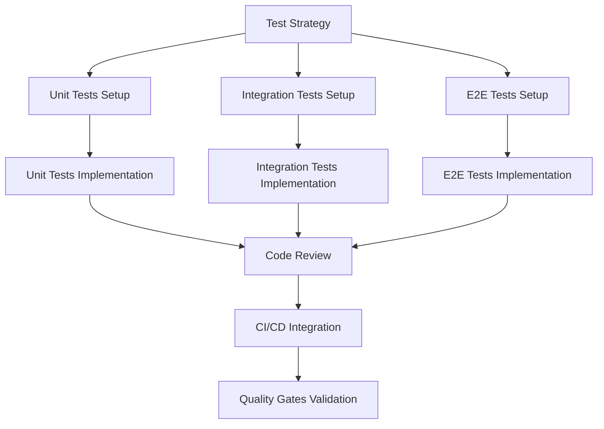

# Test Issues Checklist: Magero Store E-Commerce Platform

## Test Level Issues Creation

### Test Strategy Issue
- [ ] **Test Strategy Issue**: Overall testing approach and quality validation plan
  - **Título:** Test Strategy: Magero Store E-Commerce Platform
  - **Labels:** `test-strategy`, `istqb`, `iso25010`, `quality-gates`
  - **Estimate:** 2-3 story points
  - **Assignee:** QA Lead
  - **Dependencies:** None
  - **Description:** Define comprehensive test strategy including ISTQB framework application, ISO 25010 quality characteristics, and test environment setup

### Unit Test Issues

- [ ] **Unit Tests - Product Model**: Component-level testing for Product model
  - **Labels:** `unit-test`, `backend-test`, `models`
  - **Estimate:** 0.5 story points
  - **Test Cases:**
    - Validación de propiedades requeridas (Name, Description, Price)
    - Validación de tipos de datos
    - Validación de restricciones (Price > 0)

- [ ] **Unit Tests - CartItem Model**: Component-level testing for CartItem model
  - **Labels:** `unit-test`, `backend-test`, `models`
  - **Estimate:** 0.5 story points
  - **Test Cases:**
    - Validación de relación Product-CartItem
    - Validación de cantidad (Quantity > 0)
    - Cálculo de subtotal

- [ ] **Unit Tests - ProductsController**: Controller logic testing
  - **Labels:** `unit-test`, `backend-test`, `controllers`
  - **Estimate:** 1 story point
  - **Test Cases:**
    - Index action retorna vista con productos
    - Details action retorna producto correcto
    - Details action retorna 404 para ID inválido
    - Búsqueda funciona correctamente

- [ ] **Unit Tests - CartController**: Controller logic testing
  - **Labels:** `unit-test`, `backend-test`, `controllers`
  - **Estimate:** 1.5 story points
  - **Test Cases:**
    - Index muestra items del carrito
    - AddToCart agrega producto correctamente
    - RemoveFromCart elimina producto
    - UpdateQuantity actualiza cantidad
    - Checkout procesa orden correctamente
    - Manejo de carrito vacío

- [ ] **Unit Tests - HomeController**: Controller logic testing
  - **Labels:** `unit-test`, `backend-test`, `controllers`
  - **Estimate:** 0.5 story points
  - **Test Cases:**
    - Index action retorna vista
    - Featured products se muestran correctamente

- [ ] **Unit Tests - ApplicationDbContext**: Database context testing
  - **Labels:** `unit-test`, `backend-test`, `database-test`
  - **Estimate:** 1 story point
  - **Test Cases:**
    - Configuración de entidades correcta
    - Seed data se carga correctamente
    - Relaciones de entidades funcionan

- [ ] **Unit Tests - SessionExtensions**: Helper methods testing
  - **Labels:** `unit-test`, `backend-test`, `helpers`
  - **Estimate:** 0.5 story points
  - **Test Cases:**
    - SetObject serializa correctamente
    - GetObject deserializa correctamente
    - Manejo de valores nulos

### Integration Test Issues

- [ ] **Integration Tests - Product Catalog Flow**: Interface testing between components
  - **Labels:** `integration-test`, `backend-test`
  - **Estimate:** 1.5 story points
  - **Test Cases:**
    - Controller → DbContext → Database para listado
    - Controller → DbContext → Database para detalles
    - Búsqueda end-to-end con base de datos

- [ ] **Integration Tests - Shopping Cart Flow**: Cart operations with session and database
  - **Labels:** `integration-test`, `backend-test`, `test-critical`
  - **Estimate:** 2 story points
  - **Test Cases:**
    - Agregar producto al carrito (Controller → Session → View)
    - Actualizar cantidades (Controller → Session → Database)
    - Eliminar items (Controller → Session)
    - Persistencia de carrito en sesión
    - Múltiples items en carrito

- [ ] **Integration Tests - Checkout Process**: Complete checkout workflow
  - **Labels:** `integration-test`, `backend-test`, `test-critical`
  - **Estimate:** 2 story points
  - **Test Cases:**
    - Checkout con carrito válido
    - Validación de items disponibles
    - Limpieza de carrito post-checkout
    - Manejo de errores en checkout

- [ ] **Integration Tests - Database Operations**: Database integration testing
  - **Labels:** `integration-test`, `database-test`
  - **Estimate:** 1 story point
  - **Test Cases:**
    - CRUD operations en Products
    - Query optimization y performance
    - Transacciones y rollback
    - Data seeding y migrations

### End-to-End Test Issues (Playwright)

- [ ] **E2E Tests - Home Page**: Complete user workflow validation
  - **Labels:** `playwright`, `e2e-test`, `frontend-test`
  - **Estimate:** 2 story points
  - **Test Cases:**
    - Página de inicio carga correctamente
    - Navegación a Products funciona
    - Navegación a Cart funciona
    - Featured products se muestran
    - Responsive design en mobile/tablet/desktop

- [ ] **E2E Tests - Product Catalog**: Product browsing workflows
  - **Labels:** `playwright`, `e2e-test`, `frontend-test`, `test-critical`
  - **Estimate:** 3 story points
  - **Test Cases:**
    - Listado de productos muestra todos los items
    - Detalles de producto muestra información correcta
    - Imágenes cargan correctamente
    - Búsqueda de productos funciona
    - Filtrado por categoría (si aplica)
    - Paginación funciona (si aplica)

- [ ] **E2E Tests - Shopping Cart**: Complete cart workflows
  - **Labels:** `playwright`, `e2e-test`, `frontend-test`, `test-critical`
  - **Estimate:** 3 story points
  - **Test Cases:**
    - Agregar producto desde catálogo
    - Agregar producto desde detalles
    - Ver carrito con items
    - Actualizar cantidad de items
    - Eliminar item del carrito
    - Carrito vacío muestra mensaje apropiado
    - Total se calcula correctamente

- [ ] **E2E Tests - Checkout Flow**: Complete purchase workflow
  - **Labels:** `playwright`, `e2e-test`, `frontend-test`, `test-critical`
  - **Estimate:** 3 story points
  - **Test Cases:**
    - Proceso completo desde agregar al carrito hasta checkout
    - Validación de campos en checkout
    - Confirmación de orden
    - Carrito se limpia después de checkout
    - Mensajes de éxito/error apropiados

- [ ] **E2E Tests - Cross-Browser Compatibility**: Browser compatibility testing
  - **Labels:** `playwright`, `e2e-test`, `compatibility`
  - **Estimate:** 2 story points
  - **Browsers:** Chrome, Firefox, Safari (WebKit), Edge
  - **Test Cases:**
    - Flujo completo en cada navegador
    - Renderizado consistente
    - Funcionalidad de JavaScript

- [ ] **E2E Tests - Responsive Design**: Mobile and tablet testing
  - **Labels:** `playwright`, `e2e-test`, `frontend-test`, `mobile`
  - **Estimate:** 2 story points
  - **Viewports:** 
    - Mobile: 375x667, 414x896
    - Tablet: 768x1024, 1024x768
    - Desktop: 1920x1080, 1366x768
  - **Test Cases:**
    - Navegación responsive
    - Layout adapta correctamente
    - Touch interactions funcionan
    - Imágenes responsive

### Performance Test Issues

- [ ] **Performance Tests - Page Load Time**: Non-functional requirement validation
  - **Labels:** `performance-test`, `test-high`
  - **Estimate:** 3 story points
  - **Thresholds:**
    - Home page: < 2 segundos
    - Product listing: < 2 segundos
    - Product details: < 1.5 segundos
    - Cart page: < 1.5 segundos
  - **Tool:** Lighthouse, k6, or Playwright performance API

- [ ] **Performance Tests - Database Queries**: Query performance validation
  - **Labels:** `performance-test`, `database-test`
  - **Estimate:** 2 story points
  - **Test Cases:**
    - Query time para listado de productos
    - Query time para detalles de producto
    - Query time con 1000+ productos
    - Index optimization validation

- [ ] **Performance Tests - Concurrent Users**: Load testing
  - **Labels:** `performance-test`, `test-high`
  - **Estimate:** 4 story points
  - **Scenarios:**
    - 10 usuarios concurrentes
    - 50 usuarios concurrentes
    - 100 usuarios concurrentes
  - **Métricas:** Response time, throughput, error rate
  - **Tool:** k6 or Apache JMeter

- [ ] **Performance Tests - Memory and Resource Usage**: Resource utilization testing
  - **Labels:** `performance-test`
  - **Estimate:** 2 story points
  - **Métricas:**
    - Uso de memoria < 512MB
    - CPU usage < 50%
    - Database connections
    - Session storage

### Security Test Issues

- [ ] **Security Tests - Input Validation**: Security requirement testing
  - **Labels:** `security-test`, `test-critical`
  - **Estimate:** 3 story points
  - **Test Cases:**
    - XSS prevention en búsqueda
    - XSS prevention en inputs de checkout
    - SQL injection prevention
    - HTML injection prevention
    - Script injection prevention

- [ ] **Security Tests - Session Security**: Session management testing
  - **Labels:** `security-test`, `test-high`
  - **Estimate:** 2 story points
  - **Test Cases:**
    - Session hijacking prevention
    - Session timeout funciona
    - Secure cookie settings
    - Session data encryption

- [ ] **Security Tests - OWASP Top 10 Scan**: Vulnerability testing
  - **Labels:** `security-test`, `test-critical`
  - **Estimate:** 3 story points
  - **Tool:** OWASP ZAP, Snyk
  - **Validación:** 0 vulnerabilidades críticas, < 5 altas

- [ ] **Security Tests - Dependency Vulnerabilities**: Third-party security
  - **Labels:** `security-test`, `test-high`
  - **Estimate:** 2 story points
  - **Tool:** Dependabot, Snyk, GitHub Security Advisories
  - **Test Cases:**
    - Escaneo de paquetes NuGet
    - Escaneo de librerías frontend
    - Validación de versiones seguras

### Accessibility Test Issues

- [ ] **Accessibility Tests - WCAG Compliance**: WCAG 2.1 AA compliance validation
  - **Labels:** `accessibility-test`, `test-high`
  - **Estimate:** 3 story points
  - **Tool:** axe DevTools, Lighthouse, Playwright axe-core
  - **Test Cases:**
    - Contraste de colores adecuado
    - Navegación por teclado completa
    - Etiquetas ARIA apropiadas
    - Texto alternativo en imágenes
    - Formularios accesibles
    - Lectores de pantalla compatibles

- [ ] **Accessibility Tests - Keyboard Navigation**: Keyboard-only navigation testing
  - **Labels:** `accessibility-test`, `test-high`
  - **Estimate:** 2 story points
  - **Test Cases:**
    - Tab order lógico
    - Focus indicators visibles
    - Todas las acciones accesibles por teclado
    - Skip links funcionan
    - Modals y overlays navegables

- [ ] **Accessibility Tests - Screen Reader Compatibility**: Screen reader testing
  - **Labels:** `accessibility-test`, `test-medium`
  - **Estimate:** 2 story points
  - **Herramientas:** NVDA, JAWS, VoiceOver
  - **Test Cases:**
    - Contenido se anuncia correctamente
    - Estructura de encabezados lógica
    - Landmarks definidos
    - Formularios etiquetados correctamente

### Regression Test Issues

- [ ] **Regression Test Suite - Full Application**: Change impact testing
  - **Labels:** `regression-test`, `test-critical`
  - **Estimate:** 5 story points
  - **Scope:**
    - Todas las pruebas críticas E2E
    - Suite completa de unit tests
    - Suite completa de integration tests
  - **Trigger:** Antes de cada release
  - **Automation:** 100% automatizada en CI/CD

- [ ] **Regression Test Suite - Smoke Tests**: Critical path validation
  - **Labels:** `regression-test`, `smoke-test`, `test-critical`
  - **Estimate:** 2 story points
  - **Test Cases:**
    - Aplicación inicia correctamente
    - Home page carga
    - Listado de productos funciona
    - Agregar al carrito funciona
    - Checkout básico funciona
  - **Trigger:** Cada commit
  - **Duración objetivo:** < 5 minutos

## Test Types Identification and Prioritization

### Functional Testing Priority
**Crítico:**
- Shopping cart operations (add, update, remove)
- Checkout process
- Product catalog display
- Session management

**Alto:**
- Product search and filtering
- Navigation between pages
- Error handling and messages

**Medio:**
- Featured products display
- Product details view
- UI animations and transitions

### Non-Functional Testing Priority
**Crítico:**
- Security (input validation, XSS prevention)
- Performance (page load < 2s)
- Reliability (session persistence)

**Alto:**
- Accessibility (WCAG 2.1 AA)
- Compatibility (cross-browser)
- Usability (intuitive navigation)

**Medio:**
- Performance (concurrent users)
- Maintainability (code quality)
- Portability (deployment)

### Structural Testing Priority
**Alto:**
- Controllers: 85% coverage
- Models: 90% coverage
- Critical business logic: 95% coverage

**Medio:**
- Data access: 80% coverage
- Helpers: 75% coverage
- View models: 70% coverage

### Change-Related Testing Priority
**Crítico:**
- Smoke tests en cada commit
- Regression suite antes de release

**Alto:**
- Integration tests en cada PR
- E2E tests nightly

**Medio:**
- Performance tests semanalmente
- Security scans semanalmente

## Test Dependencies Documentation

### Implementation Dependencies

**Blocking Dependencies:**
- Test strategy must be approved before test implementation begins
- Unit test framework setup blocks unit test implementation
- Playwright setup blocks E2E test implementation
- Database migrations block integration tests
- Test data seeding blocks all database-dependent tests

### Environment Dependencies
**Required for Testing:**
- .NET 8.0 SDK
- SQLite database
- Node.js 18+ (for Playwright)
- GitHub Actions runners (for CI/CD)

**Test Environment Setup:**
1. Development environment: Local developer machines
2. CI/CD environment: GitHub Actions
3. Staging environment: Pre-production testing (future)

### Tool Dependencies
**Must be installed before test implementation:**
- xUnit framework and test runner
- Playwright and browsers
- Coverlet for code coverage
- ReportGenerator for coverage reports
- OWASP ZAP for security testing (optional)
- Lighthouse for performance testing

### Cross-Team Dependencies
**External Dependencies:**
- None (self-contained application)

**Internal Dependencies:**
- Product Owner approval for test strategy
- Development team for defect fixes
- DevOps team for CI/CD pipeline setup

## Test Coverage Targets and Metrics

### Code Coverage Targets
- **Overall:** 80% line coverage minimum
- **Critical paths:** 90% branch coverage
- **Controllers:** 85% coverage
- **Models:** 90% coverage
- **Data access:** 80% coverage
- **Business logic:** 95% coverage
- **Helper methods:** 75% coverage

### Functional Coverage Targets
- **Acceptance Criteria:** 100% validation
- **User stories:** 100% tested
- **Critical features:** 100% E2E tested
- **Edge cases:** 90% covered
- **Error scenarios:** 90% covered

### Risk Coverage Targets
- **High-risk scenarios:** 100% tested
- **Medium-risk scenarios:** 90% tested
- **Low-risk scenarios:** 70% tested

### Quality Characteristics Coverage (ISO 25010)
| Característica | Objetivo de Validación |
|----------------|----------------------|
| Functional Suitability | 100% - Todas las AC |
| Performance Efficiency | 90% - Métricas clave |
| Compatibility | 100% - Navegadores principales |
| Usability | 95% - WCAG AA + UX tests |
| Reliability | 90% - Fault tolerance tests |
| Security | 100% - OWASP Top 10 |
| Maintainability | 80% - Code quality metrics |
| Portability | 70% - Deployment scenarios |

## Success Metrics

### Test Implementation Metrics
- [ ] 100% of critical test cases implemented
- [ ] 90% test automation coverage
- [ ] < 5% test flakiness rate
- [ ] All tests documented in GitHub Issues

### Test Execution Metrics
- [ ] 95%+ test pass rate
- [ ] < 15 minutes for full regression suite
- [ ] < 5 minutes for smoke test suite
- [ ] 100% of tests run in CI/CD

### Defect Detection Metrics
- [ ] 95% defects found before production
- [ ] < 24 hours mean time to detect
- [ ] < 48 hours mean time to resolve critical defects
- [ ] 0 critical defects in production

### Quality Achievement Metrics
- [ ] 80%+ code coverage achieved
- [ ] 0 critical security vulnerabilities
- [ ] All performance benchmarks met
- [ ] WCAG 2.1 AA compliance achieved

---

**Document Version:** 1.0  
**Last Updated:** 2024  
**Total Estimated Effort:** ~60 story points  
**Estimated Timeline:** 3-4 sprints (6-8 weeks)
