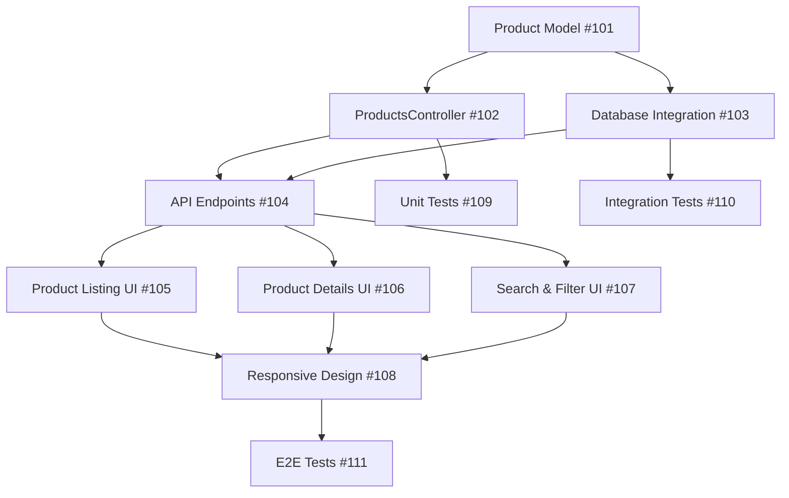

# GitHub Project Plan: Product Catalog

## Epic: E-commerce Catalog Management
**Epic Goal**: Enable customers to browse, search, and view product details in the magero-store e-commerce platform.

## GitHub Project Configuration

### Project Structure
```
E-commerce Catalog Management (Epic)
├── Product Catalog (Feature)
│   ├── Backend Implementation
│   │   ├── Product Model Enhancement (#101)
│   │   ├── ProductsController Implementation (#102)
│   │   ├── Database Integration (#103)
│   │   └── API Endpoints Configuration (#104)
│   ├── Frontend Implementation  
│   │   ├── Product Listing UI (#105)
│   │   ├── Product Details UI (#106)
│   │   ├── Search & Filter UI (#107)
│   │   └── Responsive Design (#108)
│   ├── Testing & Quality Assurance
│   │   ├── Unit Tests Implementation (#109)
│   │   ├── Integration Tests (#110)
│   │   ├── E2E Tests with Playwright (#111)
│   │   ├── Performance Testing (#112)
│   │   ├── Security Testing (#113)
│   │   └── Accessibility Testing (#114)
│   └── Documentation & Deployment
│       ├── Technical Documentation (#115)
│       ├── User Documentation (#116)
│       └── Deployment & Monitoring (#117)
```

### GitHub Labels Strategy

#### Epic/Feature Labels
- `epic:e-commerce` - E-commerce related features
- `feature:product-catalog` - Product catalog specific work
- `component:backend` - Backend/API work
- `component:frontend` - UI/UX work
- `component:testing` - Testing and QA work

#### Type Labels
- `type:enhancement` - New feature development
- `type:bug` - Bug fixes
- `type:task` - Technical tasks
- `type:documentation` - Documentation work

#### Priority Labels  
- `priority:critical` - Blocking issues, must fix immediately
- `priority:high` - Important for release
- `priority:medium` - Should be included if time permits
- `priority:low` - Nice to have

#### Status Labels
- `status:planning` - In planning phase
- `status:ready` - Ready for development
- `status:in-progress` - Currently being worked on
- `status:review` - Under code review
- `status:testing` - In testing phase
- `status:done` - Completed

### GitHub Milestones

#### Milestone 1: Backend Foundation (Week 1)
**Due Date**: End of Week 1
**Goal**: Complete backend infrastructure for product catalog

**Issues**:
- #101 Product Model Enhancement (3 SP)
- #102 ProductsController Implementation (5 SP)  
- #103 Database Integration (3 SP)
- #104 API Endpoints Configuration (2 SP)

**Acceptance Criteria**:
- [ ] Product model with validation implemented
- [ ] CRUD operations for products functional
- [ ] Database integration with Entity Framework working
- [ ] Unit tests for backend components passing

#### Milestone 2: Frontend Implementation (Week 2)
**Due Date**: End of Week 2  
**Goal**: Complete user-facing interface for product catalog

**Issues**:
- #105 Product Listing UI (4 SP)
- #106 Product Details UI (3 SP)
- #107 Search & Filter UI (4 SP)
- #108 Responsive Design (3 SP)

**Acceptance Criteria**:
- [ ] Product listing page with pagination
- [ ] Product details page with full information
- [ ] Search and filter functionality working
- [ ] Mobile-responsive design implemented

#### Milestone 3: Quality Assurance (Week 3)
**Due Date**: End of Week 3
**Goal**: Ensure quality standards and prepare for release

**Issues**:
- #109 Unit Tests Implementation (3 SP)
- #110 Integration Tests (4 SP)
- #111 E2E Tests with Playwright (5 SP)
- #112 Performance Testing (3 SP)
- #113 Security Testing (2 SP)
- #114 Accessibility Testing (3 SP)

**Acceptance Criteria**:
- [ ] 80% code coverage achieved
- [ ] All critical user flows tested
- [ ] Performance benchmarks met
- [ ] Security vulnerabilities addressed
- [ ] WCAG 2.1 AA compliance verified

### Issue Templates Usage

#### For Backend Tasks
Use **Enhancement** template with:
- `component:backend`
- `feature:product-catalog`  
- `priority:high`
- Clear technical acceptance criteria
- Dependencies on database setup

#### For Frontend Tasks  
Use **Enhancement** template with:
- `component:frontend`
- `feature:product-catalog`
- `priority:high`
- UI/UX mockup references
- Browser compatibility requirements

#### For Testing Tasks
Use **Test Strategy**, **Playwright Test**, or **Quality Assurance** templates:
- `component:testing`
- `feature:product-catalog`
- Specific test coverage requirements
- Performance and quality benchmarks

### Dependency Management

#### Critical Path Dependencies


#### Parallel Work Opportunities
- Unit tests can begin once controllers are implemented
- Frontend mockups can be developed while backend is in progress
- Test planning and framework setup can happen early
- Documentation can be written alongside development

### Team Assignment Strategy

#### Backend Team (2 developers)
- **Senior .NET Developer**: ProductsController, complex LINQ queries
- **Mid-level Developer**: Product model, database integration

#### Frontend Team (2 developers)  
- **Senior Frontend Developer**: Complex UI interactions, search functionality
- **Mid-level Developer**: Static layouts, responsive design

#### QA Team (1 QA Engineer)
- **QA Lead**: Test strategy, E2E automation, quality gates
- **Developer Support**: Unit and integration test implementation

### Sprint Planning

#### Sprint 1 (Week 1): Backend Foundation
**Sprint Goal**: Functional backend API for product operations
**Capacity**: 20 story points
- Product Model Enhancement (3 SP)
- ProductsController Implementation (5 SP)
- Database Integration (3 SP)
- API Endpoints Configuration (2 SP)
- Unit Tests Backend (3 SP)
- Documentation (2 SP)
- Buffer (2 SP)

#### Sprint 2 (Week 2): Frontend Implementation  
**Sprint Goal**: Complete user interface for product catalog
**Capacity**: 20 story points
- Product Listing UI (4 SP)
- Product Details UI (3 SP)
- Search & Filter UI (4 SP)
- Responsive Design (3 SP)
- Integration Tests (4 SP)
- Buffer (2 SP)

#### Sprint 3 (Week 3): Quality & Release
**Sprint Goal**: Quality assurance and production readiness
**Capacity**: 20 story points
- E2E Tests with Playwright (5 SP)
- Performance Testing (3 SP)
- Security Testing (2 SP)
- Accessibility Testing (3 SP)
- Bug fixes and polish (5 SP)
- Deployment preparation (2 SP)

### Definition of Done

#### Feature Level DoD
- [ ] All acceptance criteria met
- [ ] Code review completed and approved
- [ ] Unit tests written and passing (>80% coverage)
- [ ] Integration tests passing
- [ ] E2E tests covering critical paths
- [ ] Performance requirements met
- [ ] Security review completed
- [ ] Accessibility standards verified
- [ ] Documentation updated
- [ ] Deployed to staging and validated

#### Epic Level DoD  
- [ ] All feature issues closed
- [ ] End-to-end user scenarios working
- [ ] Performance benchmarks achieved
- [ ] Security audit passed
- [ ] Accessibility compliance verified
- [ ] User acceptance testing completed
- [ ] Production deployment successful
- [ ] Monitoring and alerting configured

### Risk Management

#### High-Risk Issues
- **ProductsController Implementation (#102)**: Complex pagination and search logic
  - *Mitigation*: Pair programming, early prototype
- **E2E Tests with Playwright (#111)**: New framework for team
  - *Mitigation*: Training session, expert consultation
- **Performance Testing (#112)**: May reveal architectural issues
  - *Mitigation*: Early performance validation, load testing

#### Dependencies Outside Team Control
- **Design Approval**: UX team approval for frontend designs
  - *Mitigation*: Early mockup review, regular check-ins
- **Environment Setup**: DevOps for staging environment  
  - *Mitigation*: Early request, local environment backup

### Success Metrics

#### Development Metrics
- Sprint velocity: Target 18-20 story points per sprint
- Story completion rate: >90% per sprint
- Code quality: Zero critical bugs, <5 medium bugs per release

#### Quality Metrics  
- Test coverage: >80% unit tests, 100% critical path E2E
- Performance: <2s page load, <1s search response  
- Accessibility: WCAG 2.1 AA compliance
- Security: Zero high/critical vulnerabilities

#### Business Metrics
- Feature adoption: >70% users engage with search
- Performance impact: No degradation in existing features
- User satisfaction: >4.0/5 rating in user testing